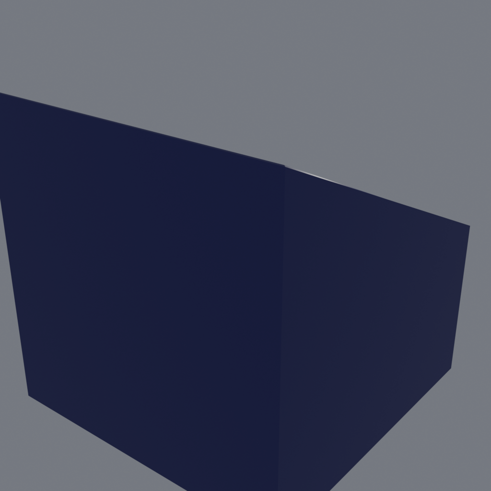

# blender-katana

Katana (blockout). Lame en acier, garde dorée, manche noir et socle. Arme de mêlée de référence pour le système d'équipement.

> Asset extrait du projet **Aetheria-Frontier** (univers de Primea).

## Aperçu



## Détails du modèle

| Propriété | Valeur |
|-----------|--------|
| Fichier Blender | `Katana.blend` |
| Meshes | 2 |
| Vertices | 72 |
| Faces (tris/quads) | 68 |
| Matériaux | Acier, Fond, noir, or |

## Structure du dépôt

```
blender-katana/
├── Katana.blend   # source Blender (blockout)
├── preview.png   # rendu d'aperçu 1024x1024
├── README.md
└── .gitignore    # ignore les sauvegardes *.blend1
```

## Remarques

- Modèle de **blockout** : topologie et matériaux destinés à la pré-production / au greyboxing.
- Aperçu : capture écran réalisée par l.auteur dans Blender.
- Les fichiers `*.blend1` de sauvegarde automatique sont exclus du versioning.

## Licence

Propriété de Utopia Software Entertainment — usage interne au projet Aetheria-Frontier.
